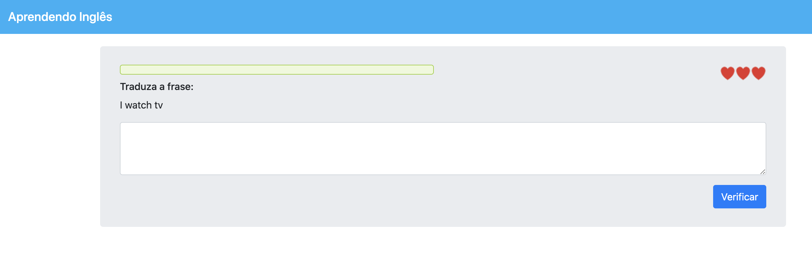

# app1_aprendendo_ingles

Aplicativo desenvolvido no curso de TypeScript e Angular da [Udemy]. (https://www.udemy.com/)

Jogo para aprender inglês, onde o jogador deve ler a frase em inglês e escrever a tradução.

## App rodando na nuvem da amazon

[START](http://app1-teste-publicacao-369.s3-website-sa-east-1.amazonaws.com/)

## Screenshots

| Printscreen da Tela |
| --------|
||

## Getting Started

Para obter ajuda sobre como iniciar o Angular, consulte nossa [documentação](https://angular.io/docs) on-line .

## Development server

Execute `ng serve` para um servidor dev. Navegue para `http://localhost:4200/` O aplicativo será recarregado automaticamente se você alterar qualquer um dos arquivos de origem.

## Mais ajuda

Para obter mais ajuda sobre o CLI angular, use `ng help` ou vá para o [Angular CLI README](https://github.com/angular/angular-cli/blob/master/README.md).

